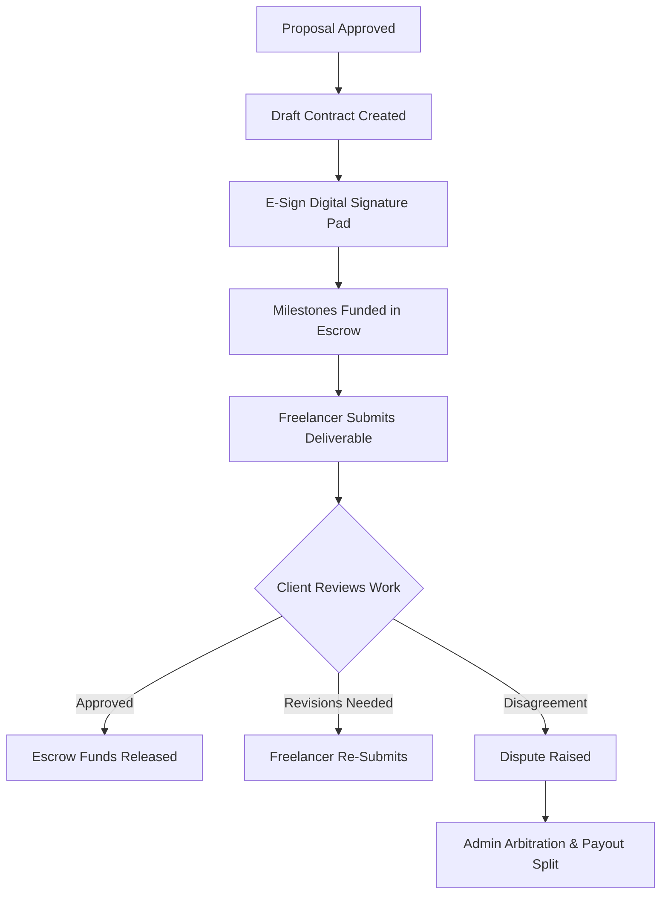

# Contract & Escrow Subsystem

GigBridge secures collaborations through digital contracts and milestone-based escrow balances. This guide explains how contracts are signed, how funds are escrowed, and how disputes are handled.

---

## 1. The Contract Lifecycle

---

## 2. The Electronic Signing (E-Sign) Workflow

Once a proposal is approved, a draft contract is generated.

- **Agreement Clauses**: Contracts incorporate standard template clauses defining intellectual property ownership, confidentiality, and platform rules.
- **Canvas Signatures**: Both parties must open the contract details page and navigate to the digital signing pad. Users sign directly on their screen using an interactive HTML5 canvas drawing pad.
- **Validation**: Digital signatures are saved as cryptographically stamped images with IP address and timestamp metadata. Contracts only transition to the "Active" state once both client and freelancer signatures are verified.

---

## 3. Milestone Escrow Subsystem

To protect both clients and freelancers, payments are structured into Milestones.

- **Milestone Creation**: The contract specifies the budget allocated to each milestone (e.g., Milestone 1: UI Mockups - 5,000,000 VND; Milestone 2: Backend Development - 10,000,000 VND).
- **Funding Escrow**: Before work begins, the client must click "Fund Milestone". The budget amount is deducted from the client's wallet balance and held in the secure platform escrow balance. Freelancers are advised not to start work until the platform confirms the milestone is **Funded**.
- **Work Submission**: The freelancer uploads deliverables (source code repository link, design file link, or documentation proof) in the Deliverables portal.
- **Release Approval**: The client reviews the deliverable. If accepted, the client clicks "Approve and Release". The funds are immediately released from escrow to the freelancer's wallet balance (minus the **10% platform commission fee**).
- **Revision Request**: If work does not meet requirements, the client rejects the submission and requests revisions with detailed notes.

---

## 4. Dispute Resolution System

If a client and a freelancer cannot reach an agreement regarding work deliverables or payment releases:

1. **Filing a Dispute**: Either party can initiate a dispute from the contract details page. This locks the milestone funds in escrow.
2. **Administrator Intervention**: The contract enters "Arbitration" state. A platform administrator is assigned to audit the case.
3. **Auditing Workspace Logs**: The administrator reviews all messages and task updates inside the project's dedicated Workspace, as well as the submitted deliverables and contract definitions.
4. **Resolution Split**: Based on the audit, the administrator decides how the escrow funds will be split (e.g., 50% refund to the client, 50% payout to the freelancer, or a complete release to one party). The admin executes the split payout, which automatically updates both user wallets and closes the dispute.
